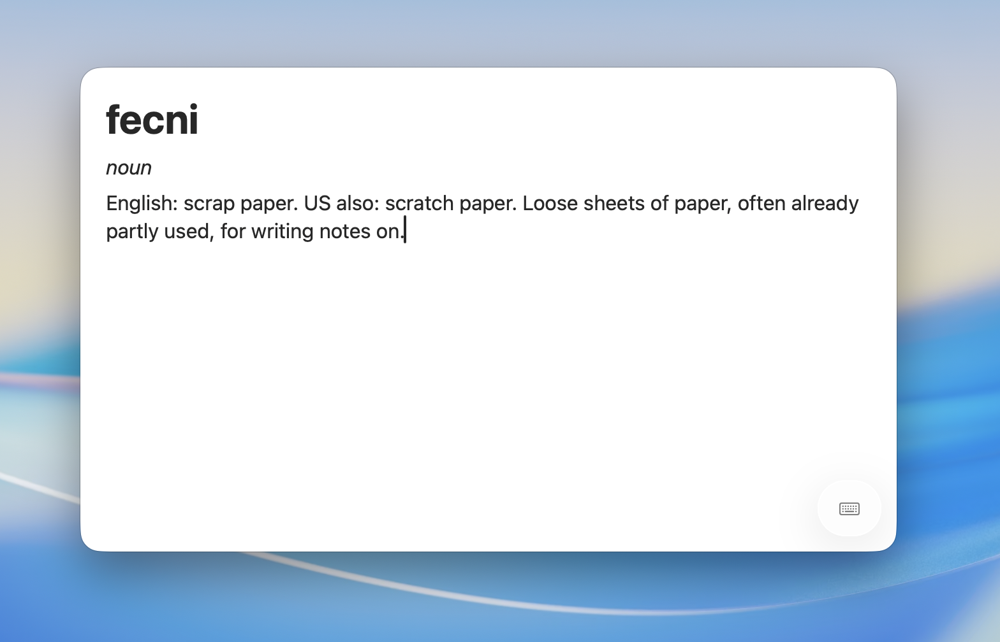

# fecni

Frictionless thought capture for macOS. Hit a global shortcut, a small editor floats up over
whatever you're doing, you jot a note in Markdown, and it saves itself to your Obsidian vault
the moment you press Esc or click away.

It's a native SwiftUI menu-bar app: no window to manage, no save button, nothing between the
thought and the file.



> **Heads up:** fecni is vibe-coded. It's also incredibly simple: it floats an editor up and
> writes a Markdown file, so there's not much that can go wrong. PRs welcome.

## Why fecni?

I wanted a fast, lightweight way to jot a note straight into my Obsidian vault, and I couldn't
find one I liked. fecni is the small thing I actually wanted: a shortcut, a field to type into,
and a plain Markdown file in your vault. Nothing else.

If you want something more, try [Collector](https://github.com/juliandeans/Collector) or [Stik](https://github.com/0xMassi/stik_app).

## How it works

1. Press the global shortcut (default **⌃⌥Space**). A floating panel appears, centered, above
   everything, including full-screen apps.
2. Type. The editor renders Markdown live: headings, bullet/numbered/task lists, code, and
   links are styled as you write, with the markup still visible. ⌘B / ⌘I / ⌘1–3 apply bold,
   italic, and headings.
3. Press **Esc** or click away. The note saves automatically as a `yyyy-MM-dd HHmm.md` file in
   your configured vault folder, and the panel disappears.

If you typed nothing, nothing is saved. If the app quits or crashes mid-note, the in-progress
text is autosaved to a draft and recovered on the next launch.

**Settings**, from the menu-bar icon, is where you pick the vault and subfolder and rebind the
shortcut. fecni reads Obsidian's own config to list your vaults, or you can point it at any folder.

## Download

Grab the latest build for your Mac from the [Releases page](https://github.com/miklosp/fecni/releases):
**`fecni-arm64.zip`** for Apple Silicon (M1 and later) or **`fecni-x86_64.zip`** for Intel. Unzip it,
and drag **fecni.app** into your Applications folder. Requires macOS 14 or later.

The app is **signed only ad-hoc, not notarized**, so on first launch macOS Gatekeeper will
refuse to open it. To allow it once:

- Double-click it, dismiss the warning, then open **System Settings → Privacy & Security**,
  scroll to the message about *fecni*, and click **Open Anyway** (confirm on the next prompt).
- Or, from Terminal: `xattr -dr com.apple.quarantine /Applications/fecni.app`

After that it launches normally. On macOS 15+ the old right-click → Open shortcut no longer
bypasses Gatekeeper for unnotarized apps, so use the Settings route above. (If you'd rather not
trust a prebuilt binary, you can build it yourself; see below.)

## Requirements

- macOS 14.0 or later. On macOS 26+ the shortcut hints render as a Liquid Glass pill; on
  14–25 they show as a static footer below the editor.
- Xcode 26.x with the Swift 6.2 toolchain to build.
- The app is non-sandboxed (Developer ID), so it writes Markdown files straight into the folder
  you choose.

## Build & run

There's no Xcode workspace, just the `.xcodeproj`. The quickest path is to open
`fecni.xcodeproj` in Xcode and press ⌘R.

From the command line:

```bash
xcodebuild -project fecni.xcodeproj -scheme fecni -configuration Debug build
xcodebuild -project fecni.xcodeproj -scheme fecni clean

# find the build output, then launch the app
xcodebuild -project fecni.xcodeproj -scheme fecni -configuration Debug -showBuildSettings | rg '^\s+BUILT_PRODUCTS_DIR'
open <BUILT_PRODUCTS_DIR>/fecni.app
```

## Project structure

```
fecni/                          App target: SwiftUI UI + AppKit glue
  fecniApp.swift                @main entry; MenuBarExtra + Settings scenes
  AppCoordinator.swift          Composition root: settings, draft store, hotkey, commit/persist
  CapturePanel.swift            Floating NSPanel (joins all Spaces, floats over full-screen)
  CapturePanelController.swift  Presents the panel; commits the note on Esc / click-away
  CaptureView.swift             CaptureModel + hosts MarkdownEngine's editor
  SettingsView.swift            Vault / subfolder pickers and the shortcut recorder
  DraftStore.swift              Debounced crash-recovery autosave
  ShortcutsHint.swift           Liquid Glass pill (macOS 26+) and static footer (14–25)
  Hotkey.swift                  Global shortcut definition (default ⌃⌥Space)

Packages/CaptureKit/            Local SPM package: deterministic, unit-tested core (no deps)
  VaultLocator.swift            Parse Obsidian's obsidian.json; list vaults & subfolders
  CaptureStore.swift            Collision-safe filename + atomic file write
  CaptureSettings.swift         CaptureSettings model + SettingsStore (UserDefaults)
  ObsidianVault.swift           Vault value type

scripts/                        Project scaffolding and build/log helpers
```

The split is deliberate: everything deterministic and testable lives in **CaptureKit**, a
dependency-free SPM package verified with `swift test`. The app target holds the SwiftUI views
and the AppKit platform glue (the floating panel, focus handling, global hotkey) that can only
be checked by running the app.

## Dependencies

- [KeyboardShortcuts](https://github.com/sindresorhus/KeyboardShortcuts) handles global hotkey
  registration and the rebind recorder UI (no Accessibility permission required).
- [swift-markdown-engine](https://github.com/nodes-app/swift-markdown-engine) (`MarkdownEngine`)
  is the native TextKit 2 Markdown editor used as the capture surface, pinned to 0.5.1.

## Tests

CaptureKit's logic is covered by SwiftPM tests:

```bash
swift test --disable-sandbox --package-path Packages/CaptureKit
```

The app itself you verify by running it. See [`CLAUDE.md`](CLAUDE.md) for why there's no
app-hosted XCTest target on the current toolchain.

## License

[MIT](LICENSE) © Miklos Petravich
